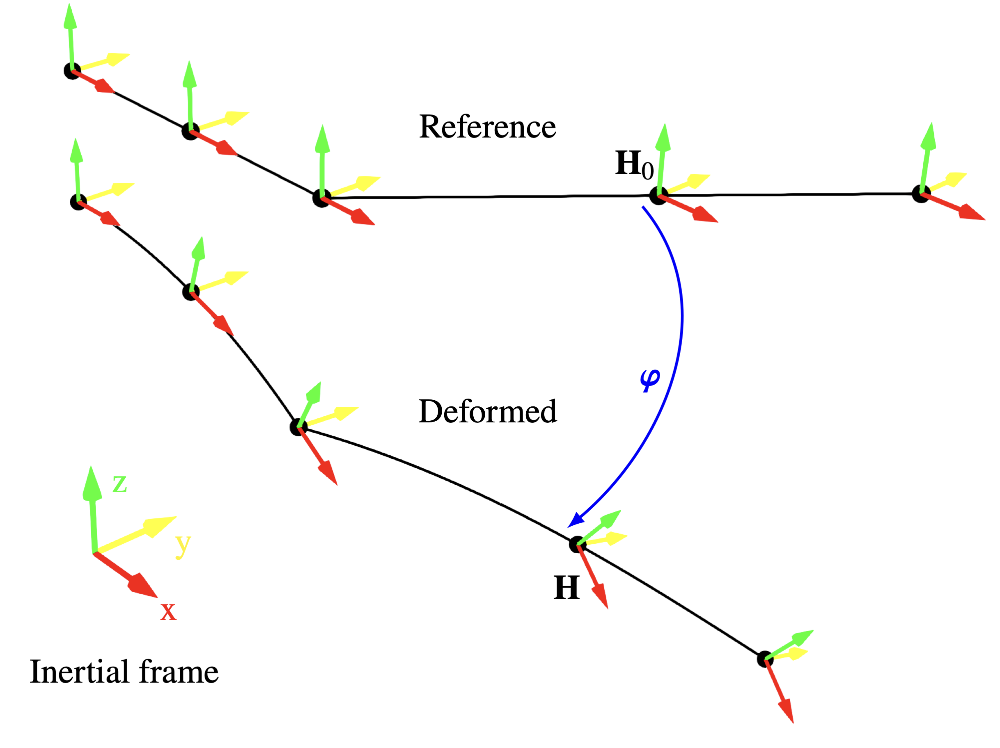

# Nonlinear beam

FLAPJAX's structural model is a geometrically-exact Cosserat beam written directly on the Lie group $\mathrm{SE} (3)$.
The formulation used is largely the same as that
of [Sonneville et. al, 2014](https://www.sciencedirect.com/science/article/pii/S0045782513002600?via%3Dihub) and the
corresponding [thesis](https://hdl.handle.net/2268/180964), with some minor modifications. This beam formulation was
chosen as it is relatively simple to formulate and implement, whilst still being locking-free and able to model large
deflections and rigid-body motions. This work makes use of a 2-noded constant curvature formulation.

This page explains the beam mathematical formulation for static and dynamic problems, and how it is implemented in
FLAPJAX. The beam code is implemented in
[`FLAPJAX.structure.beam`](../reference/structure.md).

## Lie Groups

By formulating the beam on the $\mathrm{SE} (3)$ group, we create a coordinate $\mathbf{H}$ that encapsulates both the
translational and rotational coordinates for each node

$$
\mathbf{H} = \pmb{\mathcal{H}} (\mathbf{R}, \mathbf{y}) = \begin{bmatrix} \mathbf{R} & \mathbf{y} \\ \mathbf{0}_{1 \times 3} & 1 \end{bmatrix} \in \mathrm{SE} (3),
$$

with rotation matrix $\mathbf{R} \in \mathrm{SO} (3)$ and translational coordinate $\mathbf{y} \in \mathbb{R}^3$. Whilst
this matrix is of shape $\mathbb{R}^{4 \times 4}$, it only has 6 independent degrees of freedom; 3 translation, and 3
rotational.

With both $\mathrm{SE} (3)$ and $\mathrm{SO} (3)$ being Lie groups, they are closed under matrix
multiplication $q_1, q_2 \in G, \,q_1 \cdot q_2 = q_3 \in G$ for some group $G$. This composition allows for
transformations to be combined

$$
\pmb{\mathcal{H}} (\mathbf{R}_2, \mathbf{y}_2)\,\pmb{\mathcal{H}} (\mathbf{R}_1, \mathbf{y}_1) = \pmb{\mathcal{H}} (\mathbf{R}_2\mathbf{R}_1,\; \mathbf{R}_2 \mathbf{y}_1 + \mathbf{y}_2),
$$

which matches chaining Euclidean transformations when considering rotation and displacement separately
as $\mathbb{R}^{3} \times \mathrm{SO} (3)$. An important property of a Lie group is its corresponding *Lie algebra*,
notated as $\mathfrak{g}$. This is the tangent space at the identity of the Lie group, given as

$$
\widetilde{\mathbf{h}} = \begin{bmatrix} \tilde{\mathbf{h}}_{\omega} & \mathbf{h}_u \\ \mathbf{0}_{1 \times 3} & 0 \end{bmatrix} \in \mathfrak{se} (3), \quad \tilde{\mathbf{h}}_{\omega} = \begin{bmatrix} 0 & -h_{\omega, 3} & h_{\omega, 2} \\ h_{\omega, 3} & 0 & -h_{\omega, 1} \\ -h_{\omega, 2} & h_{\omega, 1} & 0 \end{bmatrix} \in \mathfrak{so} (3),
$$

where it is apparent that the $\mathfrak{se} (3)$ and $\mathfrak{so} (3)$ algebras are isomorphic to $\mathbb{R}^6$
and $\mathbb{R}^3$ spaces, respectively,
with $\mathbf{h} = \begin{bmatrix} \mathbf{h}_u^{\top} & \mathbf{h}_{\omega}^{\top} \end{bmatrix}^{\top}$
and $\mathbf{h}_u, \mathbf{h}_{\omega} \in \mathbb{R}^3$ being the respective linear and rotational components. The Lie
algebra is useful because it has the property of a left invariant vector field

$$
\delta \mathbf{H} = \mathbf{H} \widetilde{\delta \mathbf{h}},
$$

which relates perturbations in the algebra to the group. A final property of a Lie group is that it has an exponential
map, which maps an element of the Lie algebra to the group as $\exp: \mathfrak{g} \rightarrow G$, with a corresponding
logarithmic map $\log: G \rightarrow \mathfrak{g}$. This is useful as it allows for a minimal description of
translations and rotations when in vector form, whilst allowing for compositions of transformations in the group, where
we can convert between the two forms. For simplicity of notation, we also use their equivalents for the vector space in
the following numerics, $\exp: \mathbb{R}^n \rightarrow G$ and $\log: G \rightarrow \mathbb{R}^n$. Some mathematical
properties of the exponential, logarithmic, and tangent maps are provided in the
[appendix](#appendix-lie-group-identities), which are implemented in the
[`algebra`](../reference/algebra.md) module.

## Element Formulation

The SE (3) framework has proven to be elegant for geometrically-exact beam formulations as they allow for a convenient
coupling between rotations and displacements. For a deformable beam with a 1-D coordinate along its length $\eta$, we
can obtain the spatial and temporal derivatives of the coordinates by using the left-invariant property

$$
\mathbf{H}' (\eta) = \mathbf{H} (\eta) \tilde{\mathbf{e}} (\eta)
$$

$$
\dot{\mathbf{H}} (\eta) = \mathbf{H} (\eta) \tilde{\mathbf{v}} (\eta)
$$

where $\mathbf{e} (\eta), \mathbf{v} (\eta) \in \mathbb{R}^6$ are the local beam deformation gradient and velocity,
respectively, using the notation $\dot{\bullet} = \frac{d\bullet}{dt}$
and $\bullet' = \frac{d\bullet}{d \eta}$. We can decompose the deformation gradient into a reference
component $\mathbf{e}_0$ and deformation relative to the reference $\pmb{\epsilon}$

$$
\mathbf{e} (\eta) = \mathbf{e}_0 (\eta) + \pmb{\epsilon} (\eta)
$$

where $\mathbf{e}_0 = \begin{bmatrix} 1 & \mathbf{0}_{1 \times 5} \end{bmatrix}^{\top}$ for an initially straight beam,
and $\pmb{\epsilon}$ are the local strains, which can be split into their axial/shear components $\pmb{\gamma}$ and
torsion/curvature components $\pmb{\kappa}$
as $\pmb{\epsilon} = \begin{bmatrix} \pmb{\gamma}^{\top} & \pmb{\kappa}^{\top} \end{bmatrix}^{\top}$.

We use a finite element description for a two-noded beam that has constant strain throughout their length, whilst not
being subject to shear locking. The SE (3) group is here useful, as it naturally allows for creating constant-curvature
curves in space by using the exponential map

$$
\mathbf{H} (\eta) = \mathbf{H}_0 \mathrm{exp} \left (\eta \mathbf{c}\right)
$$

for some scalar curvilinear coordinate $\eta$ and an arbitrary vector $\mathbf{c} \in \mathbb{R}^6$. In practice, we
wish to bound this curve between two nodes of an element, here denoted $A$ and $B$.

For each node, we need to consider two configurations, being their deformed $\mathbf{H}$ and initial
reference $\mathbf{H}_{0}$
coordinates. We can interpolate between these two nodes using

$$
\mathbf{H} (\eta) = \mathbf{H}_A\mathbf{H}_{\text{elem}} \exp\left (\frac{\eta}{l_0}\mathbf{d} \right) \mathbf{H}_{\text{elem}}^{-1}
$$

with $l_0$ denoting the length of the undeformed element. The local element
transformation $\mathbf{H}_{\text{elem}} = \mathcal{H} (\mathbf{R}_{\text{elem}}, \mathbf{0}_{3 \times 1})$ is a
constant matrix that gives the reference local rotation triad for the beam element relative to $\mathbf{H}_A$
and $\mathbf{H}_B$, where the local $x-$direction is aligned along the beam axis, and the remaining two axes can be
arbitrarily chosen, provided that they form an orthonormal basis. The choice not to have a basis vector of the rotation
triad in $\mathbf{H}$ aligned with the beam element is necessary to allow for discontinuities in beam structures, where
two beams with different $\mathbf{H}_{\text{elem}}$ share a common node. As such, the coordinates $\mathbf{H}_A$
and $\mathbf{H}_B$ are given relative to the inertial frame, having a
value $\mathbf{H}_0 = \pmb{\mathcal{H}} (\pmb{\mathcal{I}}_{3 \times 3}, \mathbf{y}_0)$ in the case of no deformation,
independent of beam orientation, with $\pmb{\mathcal{I}}$ being the identity matrix. From inspection of the formula for
the matrix exponential, it is apparent that the translational and rotational coordinates are coupled and not treated as
independent variables, as in some finite element formulations.

The vector $\mathbf{d}$ is referred to as the configuration vector, which describes the relative transformation between
the two nodes

$$
\mathbf{d} = \log \left (\mathbf{H}_{\text{elem}}^{-1}\mathbf{H}_A^{-1}\mathbf{H}_B\mathbf{H}_{\text{elem}} \right) \in \mathbb{R}^6
$$

where we note that $\mathbf{d}$ is invariant to Euclidean transformations applied to both $\mathbf{H}_A$
and $\mathbf{H}_B$ simultaneously. It is useful to define a vector $\pmb{\varphi} \in \mathbb{R}^6$ to describe the
relative transformation from a node in the reference case to a deformed state in compact form

$$
\mathbf{H} = \mathbf{H}_0 \exp{ (\tilde{\pmb{\varphi}})}
$$

with a visualisation of this coordinate scheme given below.

*Deformed and reference coordinates for a beam assembly.*

Operations using this vector need the tangent map to relate its perturbations to local perturbations in the group
as $\delta\mathbf{h} = \mathbf{T} (\pmb{\varphi}) \, \delta \pmb{\varphi}$, with the formulation
for $\mathbf{T} (\bullet)$ given in the [appendix](#appendix-lie-group-identities). By differentiating the beam shape
function, the spatial gradient of the element can be found, which can be related to the deformation gradient

$$
\mathbf{H}' (\eta) = \mathbf{H} (\eta) \frac{\tilde{\mathbf{d}}}{l_0} \, \Leftrightarrow \, \mathbf{e} = \frac{\mathbf{d}}{l_0}
$$

where this allows the strain, and therefore the internal forces, to be computed as a function of the configuration
vector. It is apparent here that the strain is constant for the chosen beam element.

## Structural Dynamics

Using this beam element formulation, the structural dynamics problem can be formulated for a beam assembly as

$$
\mathbf{M} (\mathbf{d}) \dot{\mathbf{v}} + \mathbf{f}_{\text{stiff}} (\mathbf{d}) + \mathbf{f}_{\text{gyr}} (\mathbf{d}, \mathbf{v}) + \mathbf{f}_{\text{ext}} (\pmb{\varphi}, \mathbf{v}) = \mathbf{0}
$$

with $\mathbf{f}_{\text{stiff}}$ being generalised stiffness forces, $\mathbf{f}_{\text{gyr}}$ being generalised
gyroscopic forces, and $\mathbf{f}_{\text{ext}}$ describing any external load. The matrix $\mathbf{M}$ is the full mass
matrix, computed by integrating the cross-sectional mass contributions $\pmb{\mathcal{M}}_{cs}$ along deformed elements
using Gaussian quadrature. Due to the choice of structural formulation, the nodal velocities $\mathbf{v}$,
accelerations $\dot{\mathbf{v}}$, and all forces are represented in the local frame of reference. Lumped mass
contributions may also be introduced into the system, which can be directly added to $\mathbf{M}$. It is notable that
only the external forcing is optionally a function of $\pmb{\varphi}$, with the deformation being described elsewhere
using only the configuration vector and, therefore, being invariant to rigid-body transformations. This formulation does
not require a vehicle intermediate frame of reference and can naturally allow for arbitrary rigid-body motion.

By removing the time-dependent terms from the above, we can describe the static problem in terms of a residual

$$
\mathbf{r}_{\mathbf{f}, \text{static}} := \mathbf{f}_{\text{stiff}} (\mathbf{d} (\pmb{\varphi})) + \mathbf{f}_{\text{ext}} (\pmb{\varphi})
$$

where we solve for transformations $\pmb{\varphi}$ by using Newton-Raphson iterations to drive the residual to zero.

To obtain a time-domain solution, we use the linearised equation

$$
\mathbf{M} (\mathbf{d}) \delta \dot{\mathbf{v}} + \mathbf{C}_T (\mathbf{d}, \mathbf{v}) \delta \mathbf{v} + \mathbf{K}_T (\mathbf{d}) \, \mathbf{T}_{\varphi} \delta \pmb{\varphi} = -\delta \mathbf{r}_{\mathbf{f}, \text{dynamic}}
$$

with $\mathbf{C}_T$ and $\mathbf{K}_T$ being the respective tangent gyroscopic and stiffness matrices,
and $\mathbf{T}_{\varphi} = \mathrm{blkdiag} (\{\pmb{\varphi}_i\}_{i=1}^N)$ relating
perturbations $\delta \pmb{\varphi}$ to their local counterparts $\delta \mathbf{h}$. The
vector $\mathbf{r}_{\mathbf{f}, \text{dynamic}}$ is the forcing residual that we wish to drive to zero.

To obtain time domain solutions using these equations, we use the Generalized$-\alpha$ time integrator for Lie groups.
This time integrator was chosen as it has been shown to give good performance for flexible beam problems. By defining a
vector $\pmb{\phi}_n$ that shifts the coordinates from timestep $n-1$ to $n$

$$
\mathbf{H}_{n} = \mathbf{H}_{n-1} \exp{ (\pmb{\phi}_n)} = \mathbf{H}_0 \exp{ (\pmb{\varphi}_{n})}
$$

the time integrator is given as

$$
\pmb{\phi}_{n} = h \mathbf{v}_{n-1} + (0.5 - \beta)h^2\mathbf{a}_{n-1} + \beta h^2 \mathbf{a}_{n}
$$

$$
\mathbf{v}_{n} = \mathbf{v}_{n-1} + (1-\gamma)h \, \mathbf{a}_{n-1} + \gamma h \, \mathbf{a}_{n}
$$

$$
\mathbf{a}_{n} = \frac{1}{1-\alpha_m}\left[(1 - \alpha_f)\dot{\mathbf{v}}_{n} + \alpha_f \dot{\mathbf{v}}_{n-1} - \alpha_m \mathbf{a}_{n-1}\right]
$$

where $h$ is the time step length and $\mathbf{a}$ is a vector of pseudo-accelerations. The time integrator internal
parameters can all be derived from the spectral radius $\lambda_{\infty} \in [0, 1]$ as

$$
\alpha_m = \frac{2 \lambda_{\infty} - 1}{\lambda_{\infty} + 1}, \quad \alpha_f = \frac{\lambda_{\infty}}{\lambda_{\infty} + 1}, \quad \gamma = \frac{3 - \lambda_{\infty}}{2 + 2\lambda_{\infty}}, \quad \beta = \frac{1}{ (1 + \lambda_{\infty})^2}
$$

$$
\gamma' = \frac{\gamma}{h \beta}, \quad \beta' = \frac{1 - \alpha_m}{h^2 \beta (1 - \alpha_f)}
$$

where lower values of $\lambda_{\infty}$ result in an increase in the numerical damping of the high-frequency content.
The problem is initialised with the predictor step

$$
\mathbf{a}_{\text{init}, n} = \frac{\alpha_f \dot{\mathbf{v}}_{n-1} - \alpha_m \mathbf{a}_{n-1}}{1-\alpha_m}
$$

which, in turn, can be used to obtain initial guesses for the other degrees of freedom. This time integrator requires
the forcing residual of the system to be driven to zero at an intermediate step $t_\alpha$
for $t_{n-1} < t_{\alpha} \le t_n$. These intermediate properties are found as

$$
\pmb{\phi}_{\alpha} = (1-\alpha_f) \pmb{\phi}_n
$$

$$
\pmb{\varphi}_{\alpha} = \log\left[\exp (\pmb{\varphi}_{n-1}) \, \exp (\pmb{\phi}_{\alpha})\right]
$$

$$
\mathbf{v}_{\alpha} = (1-\alpha_f) \mathbf{v}_n + \alpha_f \mathbf{v}_{n-1}
$$

$$
\dot{\mathbf{v}}_{\alpha} = \mathbf{a}_{\alpha} = (1-\alpha_f) \dot{\mathbf{v}}_n + \alpha_f \dot{\mathbf{v}}_{n-1} = (1-\alpha_m) \mathbf{a}_{n} + \alpha_m \mathbf{a}_{n-1}
$$

where once converged properties at this step are obtained, they can be extrapolated back to timestep $n$ using the above
formula in reverse. For simplicity of notation, we denote a set of structural degrees of freedom as

$$
\mathbf{q}_{\text{struct}} = \begin{Bmatrix} \pmb{\varphi} & \mathbf{v} & \dot{\mathbf{v}} & \mathbf{a} \end{Bmatrix}
$$

with $\pmb{\phi}$ omitted as this proves useful later in the tangent problem, where $\pmb{\varphi}$ can uniquely
describe displacement. For the corrector step, we iterate the structural problem until the time integrator and force
balance equations are satisfied. The iteration matrix is given as

$$
\mathbf{S}_T = \frac{\partial \mathbf{r}_{\mathbf{f}, \text{dynamic}, \alpha}}{\partial \pmb{\varphi}} = \beta' \mathbf{M} + \gamma'\mathbf{C}_T + \mathbf{K}_T \mathbf{T}_{\pmb{\varphi}}
$$

with all properties being evaluated at $t_{\alpha}$. This is cast as a root finding problem, using this Jacobian to
iterate $\mathbf{q}_{\text{struct}, \alpha}$ until $ \mathbf{r}_{\mathbf{f}, \text{dynamic}, \alpha}$ is sufficiently
small.

## Convergence

The static Newton-Raphson iteration and the dynamic corrector iteration share the same convergence framework
(`ConvergenceSettings` / `ConvergenceStatus` in `FLAPJAX/utils/data_structures.py`). At iteration $k$, the linear system

$$
\mathbf{S}_T \, \Delta \pmb{\varphi}^{ (k)} = -\mathbf{r}_{\mathbf{f}}^{ (k)}
$$

is solved on the free degrees of freedom (with $\mathbf{S}_T = \mathbf{K}_T \mathbf{T}_{\pmb{\varphi}}$ in the static
case), the increment is scaled by a fixed relaxation factor $\omega \in (0, 1]$ (default $\omega = 1$), and the
configuration is updated
as $\mathbf{H}^{ (k+1)} = \mathbf{H}^{ (k)} \exp{ (\widetilde{\omega \, \Delta \pmb{\varphi}^{ (k)}}})$. Convergence is
then declared as soon as *any* of the enabled criteria are satisfied

$$
\lVert \omega \Delta \pmb{\varphi}^{ (k)} \rVert < \varepsilon_{\text{abs},d}, \quad \frac{\lVert \omega \Delta \pmb{\varphi}^{ (k)} \rVert}{\lVert \pmb{\varphi}^{ (k+1)} \rVert} < \varepsilon_{\text{rel},d}, \quad \lVert \mathbf{r}_{\mathbf{f}}^{ (k)} \rVert < \varepsilon_{\text{abs},f}, \quad \frac{\lVert \mathbf{r}_{\mathbf{f}}^{ (k)} \rVert}{\lVert \mathbf{f}_{\Sigma}^{ (k)} \rVert_\infty} < \varepsilon_{\text{rel},f}
$$

where $\pmb{\varphi}^{ (k+1)}$ is the accumulated configuration vector for the current step (measured back to the
reference $\mathbf{H}_0$ in the static case, or to the predictor $\pmb{\phi}^{ (0)}$ in the dynamic case), and
$\mathbf{f}_{\Sigma}$ is the elementwise sum of $|\mathbf{f}_{\text{stiff}}|$, $|\mathbf{f}_{\text{ext}}|$,
$|\mathbf{f}_{\text{grav}}|$, $|\mathbf{f}_{\text{thrust}}|$ and, in the dynamic case,
$|\mathbf{f}_{\text{iner}} + \mathbf{f}_{\text{gyr}}|$. Normalising the force residual by the absolute sum of the
contributing terms — rather than by the applied load alone — keeps the criterion well defined when the applied and
internal forces nearly cancel. Any NaN in $\Delta \pmb{\varphi}^{ (k)}$ is caught and terminates the loop as a failure,
and a `max_n_iter` cap (default 25) bounds the iteration count when the tolerances are not met. Only tolerances
explicitly set in `ConvergenceSettings` are evaluated; at least one tolerance or `max_n_iter` must be supplied.

## Appendix: Lie Group Identities

For a Lie group with group element $\mathbf{A}$ and algebra element $\tilde{\mathbf{a}}$, we can define the exponential
and logarithmic maps using infinite summations

$$
\exp (\tilde{\mathbf{a}}) = \sum_{i=0}^{\infty} \frac{\tilde{\mathbf{a}}^i}{i!}, \quad \log (\mathbf{a}) = \sum_{i=1}^{\infty} \frac{ (\pmb{\mathcal{I}} - \mathbf{A})^i}{i}
$$

and the tangent map

$$
\mathbf{T} (\mathbf{a}) = \sum_{i=0}^{\infty} (-1)^i \frac{\hat{\mathbf{a}}^i}{ (i+1)!}
$$

where the hat operator $\hat{\bullet}$ is often referred to as the adjoint representation, being an isomorphic
map $\mathbb{R}^n \to \mathbb{R}^{n \times n}$ that
satisfies $\widetilde{\hat{\mathbf{a}}\mathbf{b}} = \tilde{\mathbf{a}}\tilde{\mathbf{b}} - \tilde{\mathbf{b}}\tilde{\mathbf{a}}$.
These are required for the structural formulation, using the operators for both $SO (3)$ and $SE (3)$.

In SO (3), for some vector $\pmb{\omega} \in \mathbb{R}^3$, $\omega = ||\pmb{\omega}||$ and group element $\mathbf{R}$,
the matrix exponential is given as

$$
\exp_{SO (3)} (\tilde{\pmb{\omega}}) = \pmb{\mathcal{I}}_{3 \times 3} + \frac{\sin (\omega)}{\omega} \tilde{\pmb{\omega}} + \frac{1-\cos (a)}{\omega^2} \tilde{\pmb{\omega}}^2, \quad
$$

with logarithm

$$
\log_{SO (3)} (\mathbf{R}) = \frac{\theta}{2 \sin (\theta)} (\mathbf{R} - \mathbf{R}^{\top}), \quad \theta = \cos^{-1}\left[\frac{1}{2}\left (\text{trace} (\mathbf{R}) - 1\right)\right]
$$

and tangent operator

$$
\mathbf{T}_{SO (3)} (\pmb{\omega}) = \pmb{\mathcal{I}}_{3 \times 3} - \frac{1-\cos (a)}{\omega^2} \tilde{\pmb{\omega}} + \frac{\omega - \sin (\omega)}{\omega^3} \tilde{\pmb{\omega}}.
$$

Equivalently, for SE (3), for some
vector $\mathbf{a} = \begin{Bmatrix} \mathbf{u}^{\top} & \pmb{\omega}^{\top} \end{Bmatrix}^{\top} \in \mathbb{R}^6$ and
group element $\mathbf{H} = \pmb{\mathcal{H}} (\mathbf{R}, \mathbf{y})$, the matrix exponential is given as

$$
\mathbf{H} (\mathbf{a}) = \exp_{SE (3)} (\tilde{\mathbf{a}}) = \begin{bmatrix} \exp_{SO (3)}{ (\pmb{\omega})} & \mathbf{T}_{SO (3)}^{\top} (\pmb{\omega}) \mathbf{u}\\ \mathbf{0}_{3 \times 1} & 1 \end{bmatrix}
$$

with logarithm

$$
\log_{SE (3)} (\pmb{\mathcal{H}} (\mathbf{R}, \mathbf{y})) = \begin{bmatrix} \log_{SO (3)} (\mathbf{R}) & \mathbf{T}_{SO (3)}^{-\top} (\pmb{\omega}) \mathbf{y} \\ \mathbf{0}_{1 \times 3} & 0 \end{bmatrix}
$$

and tangent operator

$$
\mathbf{T}_{SE (3)} (\mathbf{a}) = \begin{bmatrix} \mathbf{T}_{SO (3)} (\pmb{\omega}) & \mathbf{T}_{u\omega} (\mathbf{u}, \pmb{\omega}) \\ \mathbf{0}_{3 \times 3} & \mathbf{T}_{SO (3)} (\pmb{\omega})
\end{bmatrix}
$$

where

$$
\begin{aligned} \mathbf{T}_{u\omega} (\mathbf{u}, \pmb{\omega}) = &-\frac{1-\cos (\omega)}{\omega^2} \tilde{\mathbf{u}} + \frac{\omega - \sin (\omega)}{\omega^3} (\tilde{\mathbf{u}}\tilde{\pmb{\omega}} + \tilde{\pmb{\omega}} \tilde{\mathbf{u}}) \\ &+ \frac{\mathbf{u}^{\top} \pmb{\omega}}{\omega^2}\left[\left (\frac{2 - 2\cos (\omega)}{\omega^2} - \frac{\sin (\omega)}{\omega} \right) \tilde{\pmb{\omega}} + \left (\frac{1 - \cos (\omega)}{\omega^2} - \frac{3\omega - 3\sin (\omega)}{\omega^3}\right) \tilde{\pmb{\omega}}^2 \right]
\end{aligned}
$$

Such closed-form formulations involve singularities in their denominators for small angles $\omega \to 0$. To remedy
this, we substitute the formula for a truncated version of the corresponding infinite summation in cases with small
angles, where we restrict ourselves to the first two entries. This allows for a good approximation of both the primal
solution and the resulting derivative.