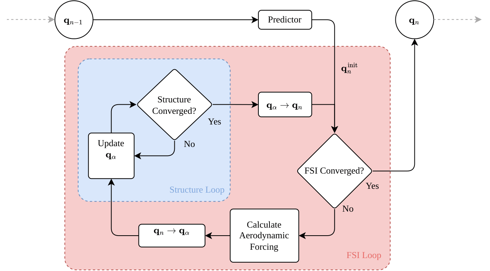

# Aeroelastic Coupling

We make use of a tightly-coupled scheme for the fluid-structure interaction (FSI) problem. This involves iterating on
the structural and aerodynamic problems in turn until convergence is reached. This is done by first evaluating the time
integrator predictor step to obtain an initial estimate for $\mathbf{q}_{\text{struct}, n}$. From this, the aerodynamic
solver is run to obtain the aerodynamic forcing, after which the structural problem is iterated until convergence. The
latter two steps are repeated until the structural update vector $\pmb{\phi}_n$ remains approximately constant between
FSI iterations. We chose to evaluate the UVLM only at discrete time steps, rather than at the intermediate $\alpha$
step. To evaluate the force at this step, we find the forcing at the discrete time steps and interpolate

$$
\mathbf{f}_{\alpha} = (1-\alpha_f) \mathbf{f}_n + \alpha_f \mathbf{f}_{n-1}
$$

where this is also used to interpolate any other external loads that can be applied to the dynamic structure.

A visualisation of the scheme is presented in the figure below.

*Procedure for time stepping the coupled primal solution from time step $n-1$ to $n$.*

## Convergence Criteria

Both the structural inner iteration and the outer FSI iteration are terminated by a shared convergence framework
(`ConvergenceSettings` / `ConvergenceStatus` in `condor/utils/data_structures.py`). At each iteration $k$ we obtain the
displacement increment $\Delta\pmb{\varphi}^{k}$ and forcing aerodynamic increment $\Delta \mathbf{f}^{k}$ relative to
iteration $k-1$, where we aim to drive both to zero (by means of having two sequential iterations that are
near-identical).

For the relative displacment residual, we compare the displacement increment to the absolute displacement, whereas for
the forcing we scale by the maximum of the sum of absolute forces which are applied. In order, these are absolute and
relative displacement residual, and an absolute and relative force residual:

$$
\lVert \Delta\pmb{\varphi}^{k} \rVert < \varepsilon_{\text{abs},d}, \quad \frac{\lVert \Delta\pmb{\varphi}^{k} \rVert}{\lVert \pmb{\varphi}^{k} \rVert} < \varepsilon_{\text{rel},d}, \quad \lVert \Delta \mathbf{f}^{k} \rVert < \varepsilon_{\text{abs},f}, \quad \frac{\lVert \Delta \mathbf{f}^{k} \rVert}{\mathrm{max} (\mathbf{f}^{k})} < \varepsilon_{\text{rel},f} \
$$

The defaults are $\varepsilon_{\text{rel},d} = \varepsilon_{\text{rel},f} = 10^{-3}$,
$\varepsilon_{\text{abs},d} = \varepsilon_{\text{abs},f} = 10^{-5}$, and a maximum of 25 outer iterations. The iteration
loop breaks as soon as any of the enabled criteria is satisfied. Only tolerances explicitly set in
`ConvergenceSettings` are checked; the others are ignored. Additionally, the loop terminates if any NaN values are found
in the displacement update, propagating a solver failure. A `max_n_iter` cap terminates the loop even when the
tolerances are never met, and either
`max_n_iter` or at least one tolerance must be supplied.

Within each FSI iteration the aero forcing on the beam is under-relaxed with an Aitken $\Delta^2$ update, which
generally improves convergence.

